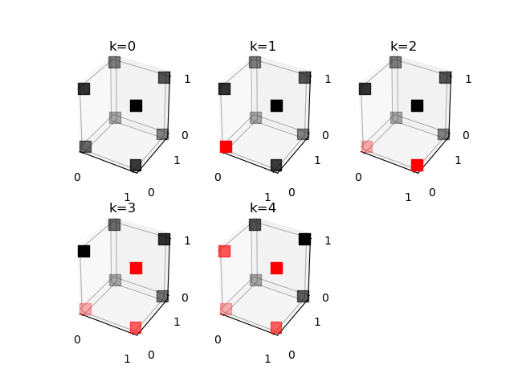
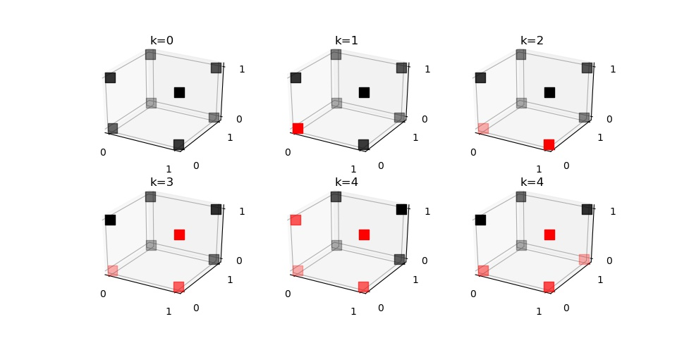

# How many linearly separable 3-dimensional Boolean functions are there?

To answer this question we derive the number of seperable
functions for the functions mapping exactly k (k = 0,1,...,8) patterns to 1
seperately. We simplify the calculations by acknowleging that there is a 
symmerty between the functions for k=0 and k=8, k=1 and
k=7, k=2 and k=6, k=3 and k=5, in the sense that they are each others negation.
More specifically, their patterns are invertions of eachothers. So in this case, 
if a boolean function is linearly seperable, then so is the negation of that 
function. This means that the functions that have this symmerty have the same 
number of linearly seperable functions. Hence we only have to derive the linearly
seperable functions for k = 0,1,2,3,4.  

Before diving in to each case we also note that for two dimensions, XOR and XNOR
are the linearly inseperable functions. This hold also for three
dimensions, meaning that if either of the six sides of the "cube"(made up of all
possible patterns) display any of these two problems, the function is linearly
inseperable. In three dimensions XOR and XNOR can also be represented as 
opposite corners of the cube which also implies inseperability. So for k < 5: if there is
one pattern with target 1 that differs in more than one dimension from all the
other patterns, the function is unseperable. And for k > 5 the same holds but
for one pattern with target 0. All this boils down to that there are only one
symmetry for each k that are linearly seperable. This symmerty will be
displayed for each k below.

### k = 0 (and k = 8)
Since either none (k=0) or all (k=8) of the patterns are 1 it is easy to see
that a decision boundary can be drawn so that all patterns end up on one side.
This gives us 2 seperable functions for this section.
### k = 1 (and k = 7)
If only one pattern is 1 one can easily draw a decision boundary that seperates
all the patterns with target 0 from

